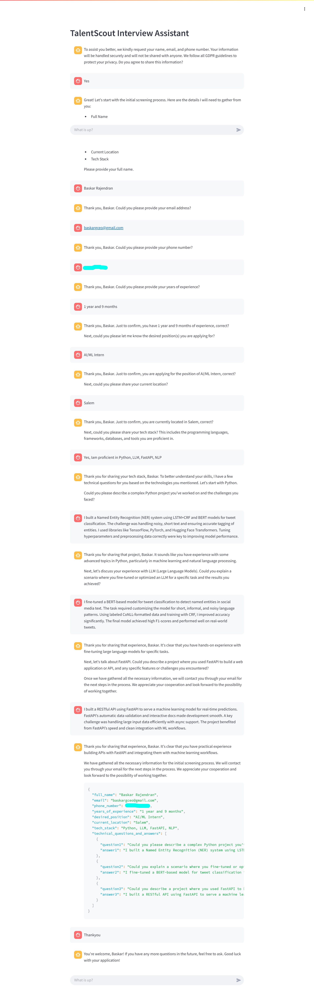

# TalentScout HR Assistant

  
*A Streamlit-based chatbot for automating the initial candidate screening process.*

---

## Project Overview

The **TalentScout HR Assistant** is a conversational AI-powered chatbot designed to streamline the hiring process. It interacts with candidates to gather essential information, such as personal details, technical skills, and experience, and asks technical questions based on the candidate's tech stack. The chatbot ensures a structured and efficient screening process while adhering to GDPR guidelines.

### Key Features:
- **Interactive Chat Interface**: A user-friendly Streamlit-based interface for seamless interaction.
- **Dynamic Questioning**: Asks technical questions based on the candidate's tech stack.
- **Structured Data Output**: Collects and formats candidate information into JSON for further processing.
- **GDPR Compliance**: Ensures candidate data is handled securely and respects privacy guidelines.

---

## Installation Instructions

### Prerequisites:
- Python 3.8 or higher
- `pip` (Python package manager)

### Steps to Set Up Locally:
1. **Clone the Repository**:
   ```bash
   git clone https://github.com/Baskar-forever/HR_Assistance_Chatbot.git
   cd HR_Assitance_Chatbot
   ```

2. **Create Virtual Environment and Activate**:
   ```bash
   python -m venv venv
   source venv/bin/activate  # On Windows: venv\Scripts\activate
   ```

3. **Install Dependencies**:
   ```bash
   pip install -r requirements.txt
   ```

4. **Set Up Environment Variables**:

   Create a `.env` file in the project root directory and add your Mistral API key:
   ```env
   MISTRAL_API_KEY=your_api_key_here
   ```

5. **Run the Application**:
   ```bash
   streamlit run app.py
   ```

6. **Access the Application**:

   Open your browser and navigate to [http://localhost:8501](http://localhost:8501)

---

## Usage Guide

### Start the Chat:
The chatbot will greet the candidate and request their consent to collect information.

### Provide Candidate Details:
The chatbot will ask for details like name, email, phone number, experience, and tech stack.

### Answer Technical Questions:
Based on the provided tech stack, the chatbot will ask 3-4 technical questions.

### End the Conversation:
Once the screening is complete, the chatbot will provide a closing message and confirm that the candidate will be contacted via email.

### View JSON Output:
The chatbot generates a structured JSON output containing all the gathered information and technical Q&A.

---

## Technical Details

### Libraries Used:
- **Streamlit**: For building the web-based chat interface.
- **LangChain**: For managing prompts and integrating with the Mistral AI model.
- **dotenv**: For securely managing environment variables.

### Model Details:
- **Mistral AI**: A conversational AI model used for generating responses and handling the interview process.

### Architectural Decisions:
- **Prompt Design**: The chatbot uses a carefully crafted system prompt to guide the conversation flow and ensure meaningful responses.
- **Session State**: Streamlit's session state is used to maintain chat history and ensure continuity in the conversation.

---

## Prompt Design

The chatbot's behavior is controlled by a detailed system prompt that:
- Outlines the information to be gathered (e.g., name, email, tech stack).
- Guides the chatbot to ask technical questions based on the candidate's skills.
- Ensures the conversation follows a logical flow by analyzing chat history.
- Provides GDPR-compliant responses and handles cases where candidates decline to share information.

---

## Challenges & Solutions

**Challenge 1: Maintaining Conversation Flow**  
- **Problem**: Ensuring the chatbot asks questions in the correct order and avoids repetition.  
- **Solution**: Used conversation history analysis to maintain context and logical flow.

**Challenge 2: Extracting Structured Data**  
- **Problem**: Parsing the chatbot's responses to extract candidate information in JSON format.  
- **Solution**: Used regex to identify and extract JSON data from the chatbot's responses.

**Challenge 3: Handling Errors**  
- **Problem**: Managing API errors or unexpected inputs.  
- **Solution**: Implemented logging and error handling to provide fallback responses.

---

## Architecture Flow



---

## Demo

https://baskar2005-hr-assistant-chatbot.hf.space

---

## License

This project is licensed under the MIT License. See the LICENSE file for details.

---

## Contact

For questions or feedback, please contact baskargceo@gmail.com.

---

### Notes:
1. Mistral API key - https://console.mistral.ai/api-keys.
2. demo link - https://baskar2005-hr-assistant-chatbot.hf.space.

